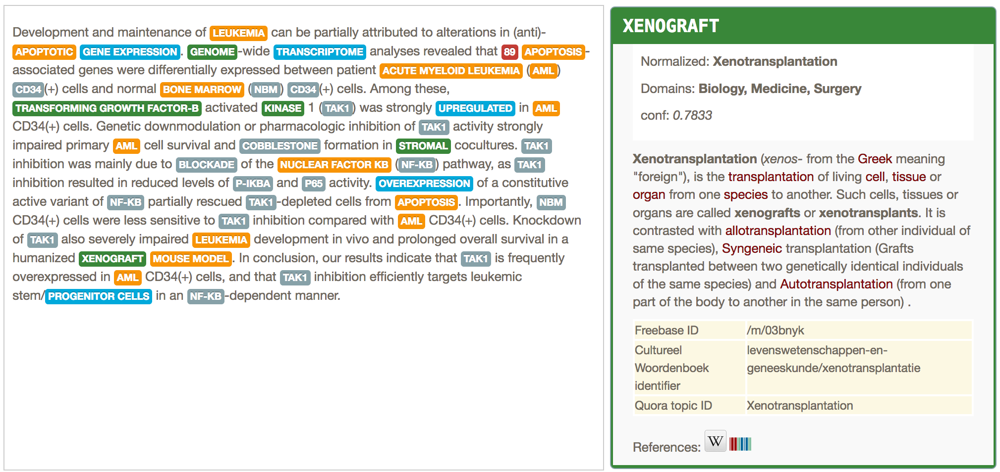
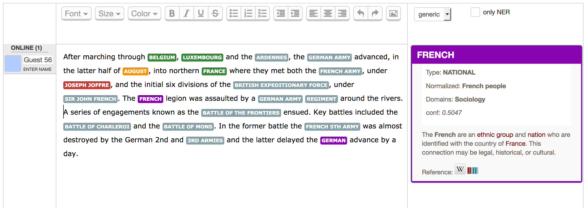

# (N)ERD

(N)ERD performs the following tasks:

* entity recognition and disambiguation against Wikipedia in raw text and partially-annotated text,


* search query disambiguation (the _short text_ mode),


* weighted term vector disambiguation (a term being a phrase),


* interactive disambiguation in text editing mode.  


Supervised machine learning is used for the disambiguation, based on a Random Forest, exploiting various features. Training is realized using Wikipedia data.  

The tool currently supports English, German and French languages. For English and French, a Name Entity Recognition based on CRF ([grobid-ner](https://github.com/kermitt2/grobid-ner)) is used in combination with the disambiguation. For each recognized entity in one language, it is possible to complement the result with crosslingual information in the two other languages. A _nbest_ mode is available. Domain information are produced for a large amount of entities in the technical and scientific fields, together with Wikipedia categories and confidence scores. 

The tool has been designed for fast processing (at least for a NERD system, 400-500 words per seconds on an medium-profile linux server), with limited memory (at least for a NERD system, here 2GB of RAM) and to offer close to state-of-the-art accuracy. (N)ERD uses the very fast SMILE ML library for machine learning and a JNI integration of LMDB as embedded database. 

(N)ERD requires JDK 1.8 and maven 3. It supports Linux-64 and Mac OS environments. Windows environment has not been tested. Bellow, we make available the LMDB binary data for Linux-64 architecture. 

## Install and build 

Running the service requires at least 2GB of RAM, but more RAM will be exploited if available for speeding up access to compiled Wikipedia data. After decompressing all the index data, 50GB of disk space will be used - be sure to have enough free space. SSD is recommanded for best performance and experience. 

First install _grobid_ and _grobid-ner_, see http://github.com/kermitt2/grobid and http://github.com/kermitt2/grobid-ner

Indicate the path to grobid-home in the file ```src/main/resource/nerd.properties```, for instance: 

```
com.scienceminer.nerd.grobid_home=../grobid/grobid-home/
com.scienceminer.nerd.grobid_properties=../grobid/grobid-home/config/grobid.properties
``` 

Then install the wikipedia index:

* download the zipped index files (warning: total around 10 GB!) at the following address: 

https://grobid.s3.amazonaws.com/nerd/db-en1.zip

https://grobid.s3.amazonaws.com/nerd/db-en2.zip

https://grobid.s3.amazonaws.com/nerd/db-fr.zip

https://grobid.s3.amazonaws.com/nerd/db-de.zip

* unzip the two archives files under ```data/wikipedia/```. This will install three sub-directories ```data/wikipedia/db-en/```, ```data/wikipedia/db-de/``` and ```data/wikipedia/db-fr/```. 

Build the project, under the NERD projet repository:

```bash
> mvn clean install    
```

Some tests will be executed. Congratulation, you're now ready to run the service. 

## Run the web service 


```bash
> mvn -Dmaven.test.skip=true jetty:run-war
```

By default the demo/console is available at [http://localhost:8090](http://localhost:8090)
The editor (client is work-in-progress, not stable) can be opened under [http://localhost:8090/editor.html](http://localhost:8090/editor.html)

The documentation of the service is available in the following document [```doc/nerd-service-manual.pdf```](https://github.com/kermitt2/nerd/raw/master/doc/nerd-service-manual.pdf).

## Contact

Author and contact: Patrice Lopez (<patrice.lopez@science-miner.com>)
