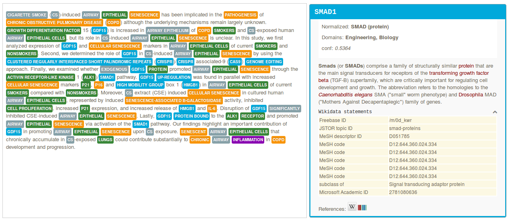
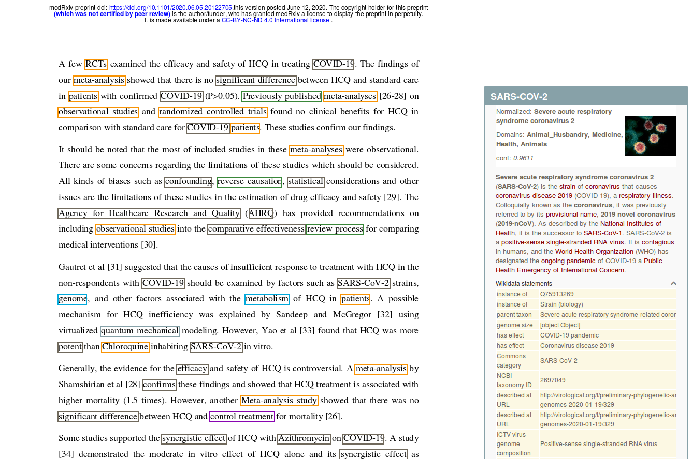

[](http://www.apache.org/licenses/LICENSE-2.0.html)
[](https://readthedocs.org/projects/nerd/?badge=latest)
[](https://archive.softwareheritage.org/browse/origin/?origin_url=https://github.com/kermitt2/entity-fishing)

# entity-fishing

*entity-fishing* performs the following tasks:

* entity recognition and disambiguation against Wikidata in a raw text or partially-annotated text segment,


* entity recognition and disambiguation against Wikidata at document level, in particular for a PDF with layout positioning and structure-aware annotations,


* search query disambiguation (the _short text_ mode) - below disambiguation of the search query "concrete pump sensor" in the service test console,


* weighted term vector disambiguation (a term being a phrase),


* interactive disambiguation in text editing mode (experimental).  


# Documentation

[Presentation of entity-fishing at WikiDataCon 2017](https://grobid.s3.amazonaws.com/presentations/29-10-2017.pdf) for some design, implementation descriptions, and some evaluations.

The documentation of *entity-fishing* is available [here](http://nerd.readthedocs.io).

# Current version

*entity-fishing* is a **work-in-progress**! Latest release version is `0.0.4`. 

This version supports English, French, German, Italian and Spanish, with an in-house Named Entity Recognizer for English and French. For this version, the knowledge base includes around 87 million entities and 1.1 billion statements from Wikidata. 

**Runtime**: on local machine (Intel Haswel i7-4790K CPU 4.00GHz - 8 cores - 16GB - SSD)

* 800 pubmed abstracts (172 787 tokens) processed in 126s with 1 client (1371 tokens/s) 

* 4800 pubmed abstracts (1 036 722 tokens) processed in 216s with 6 concurrent clients (4800 tokens/s) 

* 136 PDF (3443 pages, 1 422 943 tokens) processed in 1284s with 1 client (2.6 pages/s, 1108.2 tokens/s)

* 816 PDF (20658 pages, 8 537 658 tokens) processed in 2094s with 6 concurrent clients (9.86 pages/s, 4077 tokens/s)

**Accuracy**: f-score for disambiguation only between 76.5 and 89.1 on standard datasets (ACE2004, AIDA-CONLL-testb, AQUAINT, MSNBC) - to be improved in the next versions.

The knowledge base contains more than 1.5 billion objects, not far from 15 millions word and entity embeddings, however *entity-fishing* will work with 3-4 GB RAM memory after a 15 second start-up for the server - but please use SSD! 

## How to cite

If you want to cite this work, please refer to the present GitHub project, together with the [Software Heritage](https://www.softwareheritage.org/) project-level permanent identifier. For example, with BibTeX:

```bibtex
@misc{entity-fishing,
    title = {entity-fishing},
    howpublished = {\url{https://github.com/kermitt2/entity-fishing}},
    publisher = {GitHub},
    year = {2016--2020},
    archivePrefix = {swh},
    eprint = {1:dir:cb0ba3379413db12b0018b7c3af8d0d2d864139c}
}
```

## License and contact

Distributed under [Apache 2.0 license](http://www.apache.org/licenses/LICENSE-2.0). The dependencies used in the project are either themselves also distributed under Apache 2.0 license or distributed under a compatible license. 

Main author and contact: Patrice Lopez (<patrice.lopez@science-miner.com>)

*entity-fishing* is developed and maintained by [SCIENCE-MINER](http://science-miner.com/entity-disambiguation/) (since 2015, first Open Source public version in 2016), with contributions of [Inria](http://inria.fr) Paris (2017-2018). 
